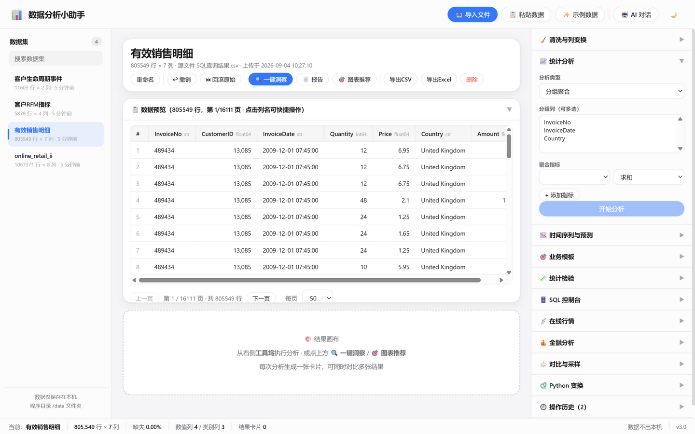
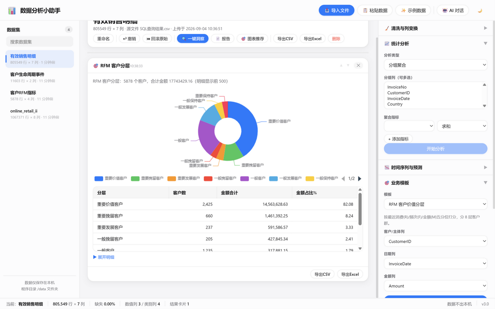
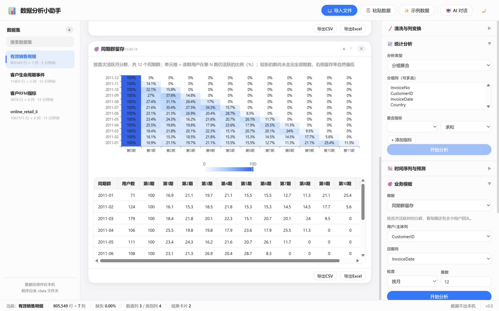
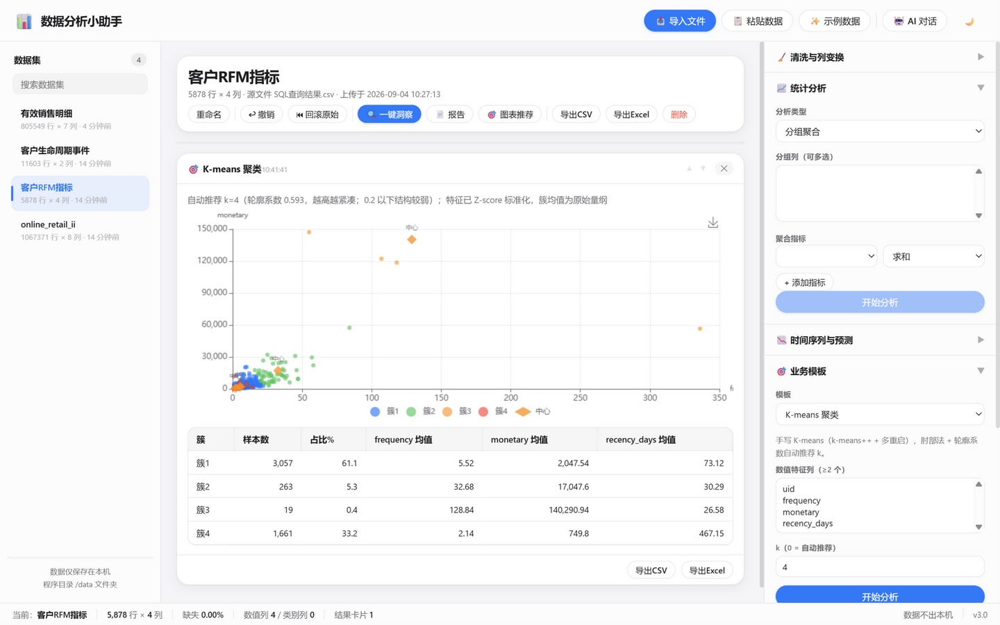
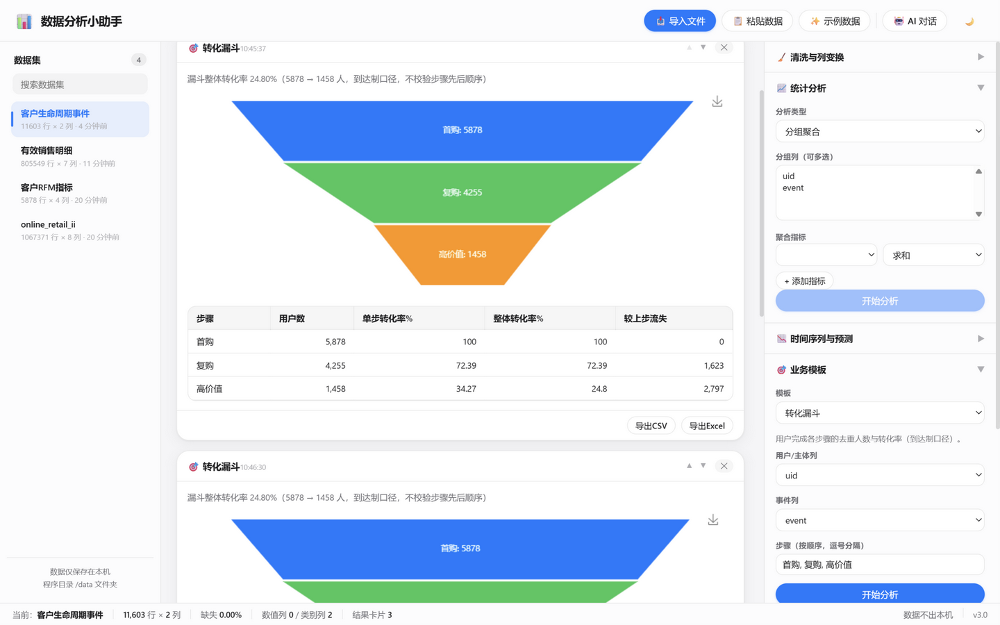
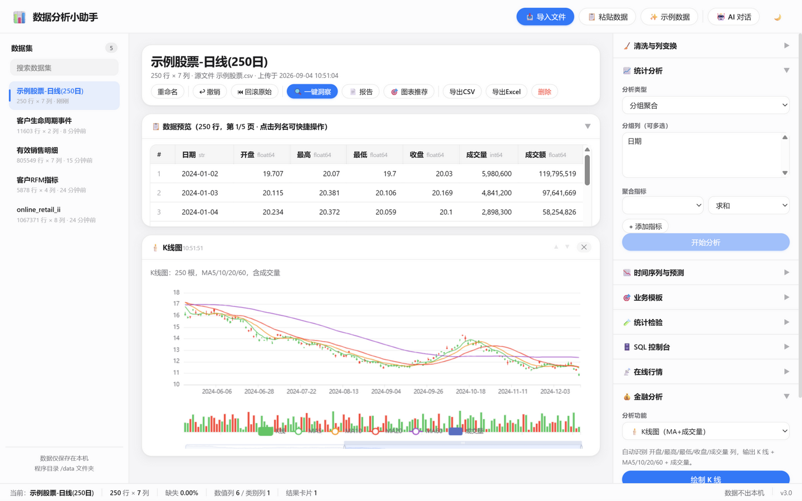
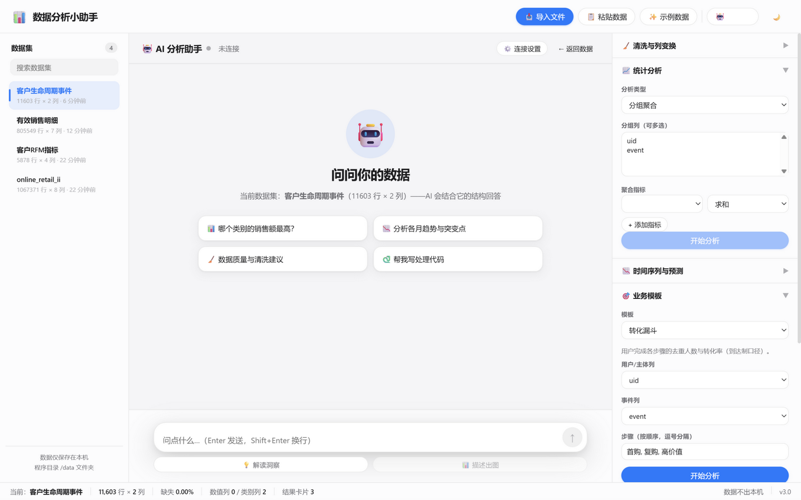

# 📊 数据分析小助手（Data Helper）

**本地运行的数据分析工作台**：导入 → 洞察 → 清洗 → SQL / 统计 / 时序 / 业务模板（RFM · 漏斗 · 留存 · 聚类 · A/B）→ AI Agent 辅助分析 → 可视化与报告。**数据全程不出本机**——AI 只看到列结构摘要，分析计算全部在你电脑上完成。

      

---

## 🖼️ 真实界面（浏览器实测截图）

| 数据工作台（80 万行真实电商数据） | RFM 客户分层 |
|---|---|
|  |  |

| 同期群留存热力图 | K-means 聚类（手写 k-means++） |
|---|---|
|  |  |

| 转化漏斗 | K 线与金融分析 |
|---|---|
|  |  |

| AI 分析助手（SSE 流式 + 工具调用） |
|---|
|  |

## ⭐ 端到端案例：百万行真实电商数据分析

用本工具对 **UCI Online Retail II**（1,067,371 行真实在线零售交易，CC BY 4.0）完成了一次完整业务分析：

- **92MB CSV 流式上传** → 分块直写 Parquet，2.6 秒完成，内存只驻留单个分块；
- SQL 清洗出 **805,549 行有效销售**，RFM 分层出 **5,878 名客户 8 个层级**；
- 发现 **41.3% 的客户贡献 82.08% 收入**、复购率 **72.39%**、头部 10% 客户贡献 **63.9%** 金额；
- 12 个同期群留存热力矩阵（M1 留存 16%~25%）、生命周期漏斗（首购→复购→高价值整体转化 **24.8%**）、K-means 自动选 k 与四簇画像（鲸鱼/批发/大众/流失）、退货与地理分析（UK 占 83%，Netherlands 户均 £2,217）；
- 沉淀 4 条可执行的运营建议（详见 **[examples/ecommerce/README.md](examples/ecommerce/README.md)**，全部结果 JSON 在 `examples/ecommerce/results/`）。

```bash
# 复现案例
.venv/Scripts/python.exe scripts/fetch_dataset.py            # 下载数据（约 43MB）
.venv/Scripts/python.exe scripts/run_ecommerce_analysis.py   # 一键重跑全部分析
```

## 🚀 快速开始

**普通用户（exe）**：双击 `数据分析小助手.exe`（单文件免安装）→ 自动打开浏览器 → 点「生成示例数据」立即体验。数据保存在 exe 同目录 `data/`。

**开发者（源码）**：

```bash
python -m venv .venv
.venv\Scripts\pip install -r requirements-dev.txt
.venv\Scripts\python run_app.py            # 或 uvicorn backend.app.main:app --port 8765 --reload
.venv\Scripts\python -m pytest tests/ -q   # 176 项测试
```

## ✨ 功能一览

| 模块 | 能力 |
|---|---|
| 📥 数据导入 | CSV / XLSX / JSON / 粘贴（Excel 复制即用）；自动识别编码与分隔符；Excel 多工作表；**>16MB 大 CSV 自动分块流式导入**（20 万行/块直写 Parquet，上限 500MB） |
| 🔍 一键洞察 | 数据质量评分（0-100 环形 + 扣分明细）+ 本地规则引擎：质量体检、分布形态、类别集中度、月度趋势、环比突变、强相关列对 → 中文要点清单 |
| 🧹 清洗与列变换 | 去重、缺失 6 式、条件筛选、异常值剔除；重命名、类型转换、分箱、独热编码、标准化、对数、日期成分提取、正则提列；一级撤销 + 回滚原始 + 操作历史 |
| 📈 统计分析 | 分组聚合、透视表、相关性（Pearson/Spearman/Kendall 卡片内切换）、直方图、箱线图、频次、describe |
| 📉 时间序列 | 趋势、同比/环比/累计、移动平均、预测（三方法留出回测 MAPE 选优 + 95% 置信区间） |
| 🎯 业务模板 | **RFM 分层**（五分位 → 8 层）、**转化漏斗**（到达制口径 + 流失明细）、**同期群留存**（月/周粒度 N 期矩阵）、**K-means 聚类**（手写 k-means++ + 多重启 + 肘部法/轮廓系数自动选 k + 簇画像散点）、ABC 帕累托、异常值检测 |
| 🧪 统计检验 | 正态性（Shapiro-Wilk/Jarque-Bera）、组间比较（Welch t/ANOVA/Mann-Whitney/Kruskal-Wallis + **Cohen's d 效应量**）、**两比例 z 检验（A/B 转化：差值 CI + 相对提升）**、**样本量计算器**（α/power/基线/MDE → 每组 n）、卡方（Cramér's V）、相关显著性 |
| 🗄️ SQL 控制台 | DuckDB 引擎，数据集注册 `ds1/ds2…`+`df`；**直接注册 Parquet 视图惰性读取**（不整表载入内存）；只读防护；结果可存为新数据集（不截断） |
| 🔌 MCP 服务端（可选） | **外接现成聊天界面**：Cherry Studio / ChatWise 等客户端填你自己的 API Key，把本软件添加为 MCP 工具源，客户端里的 AI 直接调用 15 个本地分析工具（数据集浏览/SQL/RFM/漏斗/留存/聚类/A-B/预测）——LLM 在客户端、数据在本机（[docs/MCP.md](docs/MCP.md)） |
| 🤖 AI Agent（可选） | **SSE 流式对话**（逐字渲染 + 停止按钮）；**function calling 工具循环**：12 个分析工具（RFM/漏斗/留存/聚类/A-B/预测/SQL 式聚合…）以 JSON Schema 注册，LLM 出意图、后端在本地 DataFrame 真实执行、结果卡自动回填；内存级会话历史 + schema 注入；端点不支持 tools 自动回退纯文本。**只有列结构摘要离开本机** |
| 📡 在线行情 / 💰 金融分析 | akshare（东财主源+新浪降级）；收益风险指标（年化/回撤/Sharpe/VaR…）、K 线（MA+成交量+缩放）、8 类技术指标、CAPM 基准对比、组合有效前沿、ADF/Ljung-Box |
| ⚖️ 对比与采样 | 数据集对比（列/类型/统计差异/键匹配）+ 随机/分层采样 |
| 🐍 Python 变换 | 直接写 pandas 代码，先预览后应用，30 秒超时保护 |
| 📤 导出 / 📄 报告 | 卡片与数据集导出 CSV/Excel；一键自包含 HTML 分析报告 |

## 🏗️ 架构

```
┌────────────────────────── 浏览器（无构建） ──────────────────────────┐
│  Vue3 (CDN vendor) + ECharts   ·  明/暗双主题  ·  fetch SSE 流式渲染  │
└──────────────────────────────┬───────────────────────────────────┘
                               │ HTTP / Server-Sent Events
┌──────────────────────────────┴───────────────────────────────────┐
│  FastAPI（backend/app）                                            │
│  api.py 路由层 · agent.py 工具循环 · sqlquery.py 只读防护            │
│  ┌────────── 分析引擎（全本地）───────────────────────────────┐    │
│  │ analysis 13种 · biz(RFM/漏斗/留存/手写K-means)             │    │
│  │ stats_tests(SciPy) · forecast · finance · deepprofile     │    │
│  └───────────────────────────────────────────────────────────┘    │
│  storage.py：Parquet 列存（原子写/自动迁移）+ 元信息/撤销快照         │
└──────────────────────────────┬───────────────────────────────────┘
                               │
        data/datasets/{id}/ ├─ original.*      原始上传文件
                            ├─ current.parquet 工作副本（列存压缩）
                            ├─ prev.parquet    撤销快照
                            └─ meta.json       行列/类型/操作历史
```

**性能设计**：大 CSV 分块流式读取直接写 Parquet（不整表进内存）；SQL 通过 DuckDB 视图惰性读 Parquet，聚合下推到列存引擎；RFM/漏斗/留存均在 pandas 向量化完成。百万行级 CSV 上传 2.6 秒（i5 笔记本实测），千万行级在 16GB 内存机器可处理。

## 🤖 AI Agent 工作方式（可选）

在「连接设置」填 OpenAI 兼容接口（智谱 GLM / DeepSeek / OpenAI 等，仅存本机 `data/config.json`）。不配置时其余功能完全不受影响。

```
你: 帮我给这个数据集做 RFM 分层
  ⏳ 正在执行 RFM 客户分层…          ← 工具进度（SSE tool_start）
  ✅ 已完成「RFM 客户分层」，结果卡已加入数据页
AI: 5878 名客户分为 8 层，重要价值客户 2,425 人贡献 82.08% 收入…   ← 逐字流式
```

LLM 通过 function calling 发起分析意图 → 后端在本地 DataFrame 上真实执行 → 统计结果回填给 LLM 解读、结果卡回填到数据页画布。**原始数据永不离开本机**。

## 📁 目录结构

```
data_helper/
├── backend/app/
│   ├── api.py            # 全部 HTTP 路由（含 SSE 端点）
│   ├── agent.py          # AI Agent：工具注册表 + function calling 循环
│   ├── ai.py             # LLM 配置/调用（OpenAI 兼容，掩码不回传）
│   ├── storage.py        # Parquet 存储 + 大 CSV 流式建集 + pickle 自动迁移
│   ├── sqlquery.py       # DuckDB SQL（Parquet 视图 + 只读防护）
│   ├── biz.py            # 漏斗 / 同期群留存 / 手写 K-means(k-means++)
│   ├── stats_tests.py    # 检验套件（含两比例 z + 样量计算 + Cohen's d）
│   ├── analysis.py / forecast.py / finance.py / datafeed.py / ...
│   └── logutil.py        # 控制台 + 滚动文件日志
├── frontend/             # 无构建前端（Vue3 + ECharts 本地 vendor）
├── scripts/
│   ├── fetch_dataset.py          # 下载 UCI Online Retail II → CSV
│   └── run_ecommerce_analysis.py # 端到端案例一键复跑
├── examples/ecommerce/   # 百万行电商分析叙事 + 全部结果 JSON
├── docs/FEATURES.md      # 完整功能清单（模块化，含审计验收基准）
├── docs/screenshots/     # 真实界面截图
├── tests/                # 176 项 pytest
└── .github/workflows/ci.yml  # ruff + pytest（Python 3.12/3.14）
```

## 📦 构建 exe

```bash
.venv\Scripts\python -m PyInstaller --noconfirm --onefile --name "数据分析小助手" --add-data "frontend;frontend" --collect-submodules akshare --collect-data akshare --collect-data py_mini_racer run_app.py
```

产物 `dist/数据分析小助手.exe`（约 103MB）。`--collect-data` 两个参数不可省（akshare 日历数据 / py_mini_racer 原生库）。

## 🧪 测试与质量

**176 项 pytest 全绿**：上传解析（含 GBK/JSON/XLSX/流式大文件/类型漂移回退）、Parquet 存储与 pickle 自动迁移、SQL（含建集不截断回归）、漏斗/留存/聚类业务模板、统计检验与 A/B 套件、AI Agent（mock LLM：工具循环/错误回填/降级回退/会话历史/SSE 协议）、金融、预测、报告导出等。`ruff` 零告警；CI 在 Python 3.12 / 3.14 双版本跑 lint + tests。

## ⚠️ 说明与边界

- **规模定位**：百万行为主战场；千万行级依赖列宽与内存，建议配合内置采样使用。
- **数据安全**：默认全本地。AI 开启后仅发送**列结构摘要**（列名/类型/统计量，不含明细行）；API Key 掩码存储不回传。
- **SQL 只读**：仅允许 SELECT/WITH，分号拼接逐段校验；预览超 10 万行截断展示（建集不截断）。
- 撤销为一级撤销；更早状态用「回滚原始数据」。
- Python 变换以当前用户权限执行（本地单人工具取舍）。

## 🎨 设计语言

遵循 [Apple HIG](https://developer.apple.com/design/human-interface-guidelines)：毛玻璃材质、系统色板、胶囊按钮与分段控件、连续大圆角、8pt 网格、柔和多层阴影与微动效；ECharts 文字颜色随明暗主题自适应。

## 🙏 思路参考

[ydata-profiling](https://github.com/ydataai/ydata-profiling) · [DuckDB](https://duckdb.org/docs/lts/guides/python/sql_on_pandas.html) · [Tableau Workspace / Show Me](https://help.tableau.com/current/pro/desktop/en-us/environment_workspace.htm) · [Hex](https://learn.hex.tech/docs/explore-data/projects/projects-introduction)

## 📄 License

[MIT](LICENSE)
