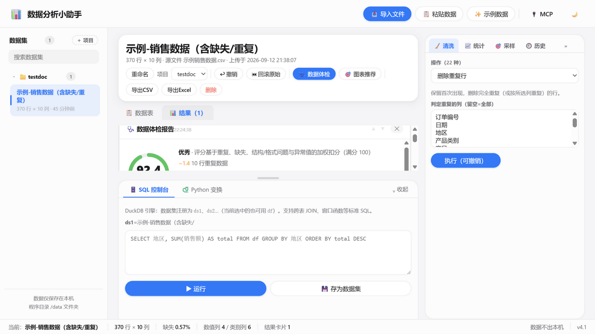

# 📊 数据分析小助手（Data Helper）

**本地运行的数据预处理助手**：导入 → 🩺 数据体检（发现明显问题）→ 🔧 一键修复 / 清洗 → 简单可视化 → 导出，把干净数据交给你的主力分析软件。各行各业通用，检查规则只看"数据长什么样"，不预设业务含义。**数据全程不出本机**——AI 只看到列结构摘要。

      

---

## 🖼️ 真实界面（浏览器实测截图）

| IDE 式工作台：电子表格式数据表 + 右侧工具栏 + 底部 SQL/Python |
|---|
|  |

**v4.1 界面重设计（v4.3 布局微调）**：主页是极简拖拽导入区；进入数据集后为 IDE 式布局——主区「📋 数据表 / 📊 结果」双 tab（表格占满主区：列头点击排序 ↖↘三态、▾ 下拉按值勾选筛选含缺失∅、冻结表头与行号列）；**右侧工具栏**（🧹清洗 / 📈统计 / 🎯采样 / 🕘历史，可收起为图标栏）；**底部面板**（🗄️SQL 控制台 / 🐍Python 变换，可拖高分隔条、双击复位、可折叠）。体检出结果自动切「结果」tab，问题条目的 🔧 修复按钮自动预填右侧清洗面板。

## ⭐ 端到端案例：百万行真实电商数据预处理

用本工具对 **UCI Online Retail II**（1,067,371 行真实在线零售交易，CC BY 4.0）跑完整预处理流水线：

- **92MB CSV 流式上传 2.9 秒**（分块直写 Parquet）；
- 一键体检发现 **15 项问题**：34,335 行重复、`Description` 20% 带首尾空格、`StockCode` 混合类型、`Quantity` 2.3 万个负值（退货/取消单）；
- SQL 一步清洗出 **805,549 行有效销售**，复检对比评分变化；
- 导出 46.5MB 干净 CSV（详见 **[examples/ecommerce/README.md](examples/ecommerce/README.md)**，结果 JSON 在 `examples/ecommerce/results/`）。

```bash
# 复现案例
.venv/Scripts/python.exe scripts/fetch_dataset.py            # 下载数据（约 43MB）
.venv/Scripts/python.exe scripts/run_ecommerce_analysis.py   # 一键重跑体检→清洗→复检→导出
```

## 🚀 快速开始

**普通用户（exe）**：双击 `数据分析小助手.exe`（单文件免安装）→ 自动打开浏览器 → 点「生成示例数据」立即体验。数据保存在 exe 同目录 `data/`。完整使用说明见 **[docs/使用手册.md](docs/使用手册.md)**。

**在线版（web）**：`webview` 分支提供 Dockerfile，可一键部署到腾讯云 CloudBase 云托管（容器型，支持从 GitHub 仓库自动构建），浏览器直接访问，无需安装。步骤与注意事项见 **[docs/DEPLOY_CLOUDBASE.md](docs/DEPLOY_CLOUDBASE.md)**。

**开发者（源码）**：

```bash
python -m venv .venv
.venv\Scripts\pip install -r requirements-dev.txt
.venv\Scripts\python run_app.py            # 或 uvicorn backend.app.main:app --port 8765 --reload
.venv\Scripts\python -m pytest tests/ -q   # 198 项测试
```

## ✨ 功能一览

| 模块 | 能力 |
|---|---|
| 📥 数据导入 | CSV / XLSX / JSON / 粘贴（Excel 复制即用）；自动识别编码与分隔符；Excel 多工作表；**>16MB 大 CSV 自动分块流式导入**（20 万行/块直写 Parquet，上限 500MB） |
| 🩺 数据体检 | **一键体检（纯本地规则引擎，行业无关）**：质量评分 0-100 + **六维质量雷达**（完整性/唯一性/一致性/有效性/及时性/结构）+ 结构化问题清单（🔴严重/🟡警告/🔵提示），每条带证据样本；检查覆盖 **结构**（重复行/重复列名/常量列/空列/ID 列键重复）、**缺失**（整体与列级/空串≠缺失）、**类型**（文本数字/混合类型/带格式数字 `1,234`·`¥100`·`12%`·`1.5万`·全角数字/日期文本/混合日期格式/手机号·邮箱·网址·身份证格式违反/长度异常）、**文本脏污**（首尾空格含全角/控制与零宽字符/连续空格）、**类别一致性**（同义标签/布尔语义不统一）、**数值合理性**（离群/负值/高零占比/小数位异常/量级断裂疑单位混用）、**日期合理性**（未来日期/超远历史/重复时间戳/时间覆盖缺口）、**列间一致性**（算术关系 `数量×单价≈金额` 违反行/函数依赖冲突"同订单号不同客户"） |
| 🔧 一键修复 | 体检问题条目带**修复按钮**：点击自动预填清洗面板参数（如发现重复→预填去重、同义标签→预填值映射、带格式数字→预填智能数值解析），确认后执行 |
| 🧹 清洗与列变换 | **22 种操作**：行级（去重/删缺失/填充 7 式含时序插值/条件筛选 12 操作符/异常值剔除/**盖帽不删行**）；文本与格式（**去首尾空格/规范化（全角转半角+去控制字符+压缩空格）/智能数值解析/值映射/拆分列/布尔统一**）；列级（重命名/删除/按缺失率删列/类型转换/分箱/独热/标准化/对数/日期成分/正则提取）；连续多级撤销 + 回滚原始 + 操作历史 |
| 🗂 项目化管理 | 数据集按项目分组（新建/重命名/删除/折叠）；导入时选目标项目；**采样、SQL 建集、工作表导入的派生表自动留在源表所在项目**并带 ↳ 溯源标记；随时移动数据集到其他项目 |
| ⏪ 多步回溯 | 每次清洗/变换前自动保存版本快照（硬链接零拷贝，最多 20 份）；历史面板任意一步「回到这步」；**回错可再跳回**（分支保留，做新操作才丢弃未走分支）；回滚原始 = 秒回 v0 |
| 🐍 Python 变换 | 直接写 pandas 代码，**先预览后应用**（快照重放防错版），30 秒超时保护 |
| 📊 快速统计与图表 | 分组聚合、相关性（Pearson/Spearman/Kendall 卡片内切换）、直方图、箱线图、频次、describe、时间趋势、异常值检测；**深度画像**：缺失矩阵热力图、重复行明细、两列散点、文本长度统计 |
| 🗄️ SQL 控制台 | DuckDB 引擎，数据集注册 `ds1/ds2…`+`df`；**直接注册 Parquet 视图惰性读取**；只读防护；结果可存为新数据集（不截断） |
| 🤖 AI Agent（可选，后端保留） | 后端 function calling 工具循环完整保留（体检/汇总/分组/趋势/相关/直方图/频次），**应用内对话界面已在 v4.1 移除**，推荐经 🔌 MCP 外接客户端使用；后续想恢复只需加回 UI |
| 🔌 MCP 服务端（可选） | **外接现成聊天界面**：Cherry Studio / ChatWise 等客户端填你自己的 API Key，把本软件添加为 MCP 工具源，10 个只读工具（数据集浏览/体检/SQL/统计摘要）——LLM 在客户端、数据在本机（[docs/MCP.md](docs/MCP.md)） |
| 🎯 采样 | 随机 / 分层 / 前 N 行，结果另存新数据集 |
| 📤 导出 | 数据集与结果卡导出 CSV / Excel |

**v4.0 说明**：本版本聚焦预处理助手定位，移除了 v3 的业务模板（RFM/漏斗/留存/聚类）、统计检验、时序预测、金融分析与在线行情等复杂分析功能——这些交给专业分析软件更合适。**v4.1** 重设计了前端交互（IDE 式工作台，见上方界面说明）并移除了应用内 AI 对话界面（后端能力保留）。**v4.2** 新增数据集项目化管理与多步回溯。

## 🏗️ 架构

```
┌────────────────────────── 浏览器（无构建） ──────────────────────────┐
│  Vue3 (CDN vendor) + ECharts   ·  明/暗双主题  ·  fetch SSE 流式渲染  │
└──────────────────────────────┬───────────────────────────────────┘
                               │ HTTP / Server-Sent Events
┌──────────────────────────────┴───────────────────────────────────┐
│  FastAPI（backend/app）                                            │
│  api.py 路由层 · agent.py 工具循环 · sqlquery.py 只读防护            │
│  ┌────────── 体检与清洗引擎（全本地）──────────────────────────┐    │
│  │ insights(体检规则引擎) · cleaning(22 op) · transform       │    │
│  │ analysis(快速统计) · deepprofile(深度画像) · suggest      │    │
│  └──────────────────────────────────────────────────────────┘    │
│  storage.py：Parquet 列存（原子写/自动迁移）+ 项目注册表/版本快照      │
└──────────────────────────────┬───────────────────────────────────┘
                               │
        data/datasets/{id}/ ├─ original.*      原始上传文件
                            ├─ current.parquet 工作副本（列存压缩）
                            ├─ versions/v{n}   版本快照（硬链接零拷贝，多步回溯）
                            └─ meta.json       行列/类型/项目归属/版本号/操作历史
        data/projects.json    项目注册表
```

**性能设计**：大 CSV 分块流式读取直接写 Parquet（不整表进内存）；SQL 通过 DuckDB 视图惰性读 Parquet；体检的逐值扫描（数值/日期解析）在采样上执行并全列向量化正则，百万行秒级完成。

## 🤖 AI 能力的现状（可选）

v4.1 起应用内对话界面已移除，但**后端 AI 能力完整保留**（`/api/ai/*` 路由、agent 工具循环、OpenAI 兼容配置接口），后续恢复只需加回 UI。当前推荐用法是 **MCP 外接**：顶栏「🔌 MCP」按钮复制地址，到 Cherry Studio / ChatWise 等客户端填你自己的 API Key 添加为工具源，即可在客户端里对话式体检与查询（配置步骤见 [docs/MCP.md](docs/MCP.md)）。LLM 只能看到列结构摘要与查询结果，**原始数据永不离开本机**。

## 📁 目录结构

```
data_helper/
├── backend/app/
│   ├── api.py            # 全部 HTTP 路由（含 SSE 端点）
│   ├── insights.py       # 数据体检：规则引擎 + 质量评分 + 修复建议
│   ├── cleaning.py       # 22 种清洗操作（含文本格式清洗）
│   ├── agent.py          # AI Agent：工具注册表 + function calling 循环
│   ├── ai.py             # LLM 配置/调用（OpenAI 兼容，掩码不回传）
│   ├── storage.py        # Parquet 存储 + 大 CSV 流式建集 + pickle 自动迁移
│   ├── sqlquery.py       # DuckDB SQL（Parquet 视图 + 只读防护）
│   ├── analysis.py / deepprofile.py / suggest.py / transform.py / ...
│   └── logutil.py        # 控制台 + 滚动文件日志
├── frontend/             # 无构建前端（Vue3 + ECharts 本地 vendor）
├── scripts/
│   ├── fetch_dataset.py          # 下载 UCI Online Retail II → CSV
│   └── run_ecommerce_analysis.py # 端到端预处理案例一键复跑
├── examples/ecommerce/   # 百万行预处理叙事 + 全部结果 JSON
├── docs/FEATURES.md      # 完整功能清单（模块化，含审计验收基准）
├── docs/使用手册.md       # 面向普通用户的使用手册
├── docs/DEPLOY_CLOUDBASE.md # CloudBase 云托管部署指南（webview 分支，Docker）
├── Dockerfile            # 云托管容器镜像（监听平台注入的 PORT）
├── tests/                # 198 项 pytest
└── .github/workflows/ci.yml  # ruff + pytest（Python 3.12/3.14）
```

## 📦 构建 exe

```bash
.venv\Scripts\python -m PyInstaller --noconfirm --onefile --name "数据分析小助手" --add-data "frontend;frontend" run_app.py
```

产物 `dist/数据分析小助手.exe`。

## 🧪 测试与质量

**198 项 pytest 全绿**：上传解析（含 GBK/JSON/XLSX/流式大文件/类型漂移回退）、Parquet 存储与迁移、SQL（含建集不截断回归）、**体检规则逐条命中/干净数据放行/一键修复可执行契约**、**8 个新清洗操作正反例**、AI Agent（mock LLM：工具循环/错误回填/降级回退/会话历史/SSE 协议）、MCP 协议等。`ruff` 零告警；CI 在 Python 3.12 / 3.14 双版本跑 lint + tests。

## ⚠️ 说明与边界

- **规模定位**：百万行为主战场；千万行级依赖列宽与内存，建议配合采样使用。
- **数据安全**：默认全本地。AI 开启后仅发送**列结构摘要**（列名/类型/统计量，不含明细行）；API Key 掩码存储不回传。
- **SQL 只读**：仅允许 SELECT/WITH，分号拼接逐段校验；预览超 10 万行截断展示（建集不截断）。
- **体检是建议不是判决**：重复行、离群值等发现需结合业务判断（如零售流水同单同品多行属正常），一键修复前请确认参数。
- 撤销支持连续多级（每次操作前都有版本快照）；历史面板可跳回任意一步，回错还能再跳回来；快照最多保留 20 份，超出淘汰最旧。
- Python 变换以当前用户权限执行（本地单人工具取舍）。

## 🎨 设计语言

遵循 [Apple HIG](https://developer.apple.com/design/human-interface-guidelines)：毛玻璃材质、系统色板、胶囊按钮与分段控件、连续大圆角、8pt 网格、柔和多层阴影与微动效；ECharts 文字颜色随明暗主题自适应。

## 🙏 思路参考

[ydata-profiling](https://github.com/ydataai/ydata-profiling) · [DuckDB](https://duckdb.org/docs/lts/guides/python/sql_on_pandas.html) · [OpenRefine（文本清洗）](https://openrefine.org/) · [Tableau Show Me](https://help.tableau.com/current/pro/desktop/en-us/environment_workspace.htm)

## 📄 License

[MIT](LICENSE)
